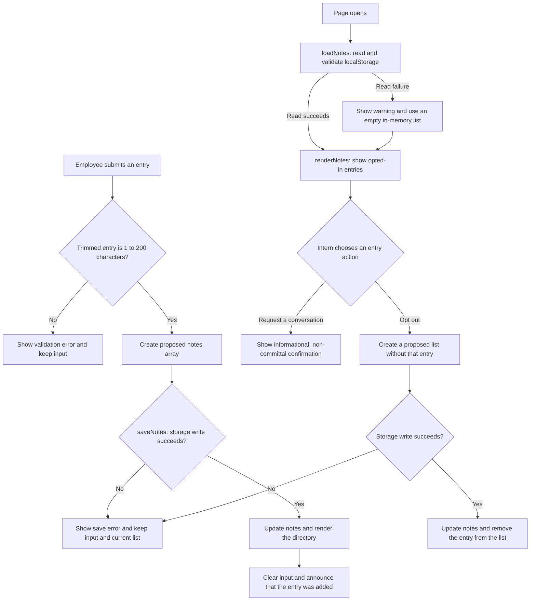

# Opt-in Conversation Directory

<!-- Badges are optional but cheap. shields.io generates them from a URL. -->


> HW3, MGT 3745 O. A small static prototype for finding an opted-in employee who is willing to have an informal conversation with an intern.


## What

This project adapts the supplied meeting-notes starter into an opt-in directory. An employee can add a short directory entry, an intern can request an informational conversation, and the employee can later opt out. The project is framed around the problem in [context/PROJECT.md](context/PROJECT.md) and the user research in [context/USERS.md](context/USERS.md), with the selected feature specification in [context/FEATURES.md](context/FEATURES.md).

## See It Work

There is a file under [docs](docs) named Photo Evidence for Opt-in Directory that contains a screenshot of the working directory. Here is a link to it: 

<!-- HTML gives you sizing control markdown does not: -->
<!--  -->

## How to Run

Create your repository from the instructor's HW3 template and name it `mgt3745-hw3`. The supplied app is a starter; adapt it to one feature from your own specification.
This project runs inside a GitHub Codespace. No local install.

1. On your repository page, click **Code → Codespaces → Create codespace on main**. Wait for setup to finish; first-boot time varies.
2. Keep the supplied [.devcontainer/devcontainer.json](.devcontainer/devcontainer.json). It configures Live Server installation and port 5500 forwarding. Once the extension is ready, right-click [index.html](index.html) and choose **Open with Live Server**.
3. If a browser tab does not open, use the **Ports** tab to open port 5500. Keep its visibility **Private**.
4. With Live Server running, save your edits to reload the page.

If Live Server is unavailable, run `node scripts/serve.mjs` in the terminal, then open port 5500 from the Ports tab. Refresh the browser after edits when using this fallback; stop it with **Ctrl+C**. The fallback server is [scripts/serve.mjs](scripts/serve.mjs).

<!-- The .devcontainer folder installs Live Server automatically. If the right-click option
     is missing, wait for the extension to finish installing (bottom-left status bar), or run
     `python3 -m http.server 5500` in the terminal and open port 5500 from the Ports tab.
     Edit these steps if your feature needs anything more. -->

## How It Works

<!-- GitHub renders Mermaid natively inside a ```mermaid fence. -->



In [app.js](app.js), `loadNotes` reads and validates the browser-local list, `saveNotes` persists a proposed state, and `renderNotes` draws each opted-in entry. The submit handler validates the trimmed entry and keeps the current input visible if the entry is invalid. The request interaction uses DOM creation and `textContent` so that user-entered text is treated as plain text instead of HTML.

## Status

| Area | State | Why |
|------|-------|-----|
| Save and display | Works | The implementation writes to `localStorage` in `saveNotes` and redraws the directory in `renderNotes` in [app.js](app.js). |
| Invalid input | Works | The submit handler rejects entries shorter than 1 character or longer than 200 characters and keeps the input in place in [app.js](app.js). |
| Storage read and save failure handling | Partially verified | `loadNotes` warns on unreadable or invalid stored data without altering the original storage, and `saveNotes` stops a write when the write fails. The logic is in [app.js](app.js). |
| Multi-user sync (starter limitation) | Deferred | Browser-local storage is intentionally single-device and not synchronized. The scope decision is documented in [context/ARCHITECTURE.md](context/ARCHITECTURE.md). |

<details>
<summary>Verification results (click to expand)</summary>

The full verification record stays in [context/FEATURES.md](context/FEATURES.md). This summary keeps it aligned with the current prototype and notes the boundaries of what is actually checked.

| Criterion / EARS statement | Steps and input | Expected result | Observed result | Status | Evidence / commit |
|---|---|---|---|---|---|
| F-02 request confirmation | Open the directory and click `Request a conversation` for an entry. | The action appears informational and non-committal. | The click reveals a status message that says the request is informational and non-committal. | PASS | [context/FEATURES.md](context/FEATURES.md) |
| F-01 opt-out | Click `Opt out` for a visible entry. | The employee is removed from the directory immediately. | The entry is removed and the list is re-rendered without reloading the page. | PASS | [context/FEATURES.md](context/FEATURES.md) |
| Save failure | Open the page with `?failSave`, enter a valid entry, and submit it. | The write should fail without changing the stored directory or visible list. | The app contains a repeatable simulated write-failure path and preserves the current list and input while showing an error. | PASS (simulated by code path) | [app.js](app.js) |

PASS means the observed behavior matches the expectation in the current implementation. Storage-failure behavior is verified through the classroom simulation switch in [app.js](app.js), not by a real production storage outage.

</details>

## Links

Read in this order:

SCAFFOLD_MANIFEST.md: explains what carries over from HW2 into HW3, along with a submission checklist
context/PROJECT.md: the problem and its framing
context/USERS.md: who this is for
context/FEATURES.md: what it must do, and verification results
context/ARCHITECTURE.md: the gate and ADR-001
context/STANDARDS.md: the rules this code follows
context/CLAUDE.md: the same rules, for agents
The scaffold has eleven canonical files in /context: six active files above and five previews: STYLE.md, TOOLS.md, SKILLS.md, EVALS.md, and AGENTS.md. Keep the previews; verification stays in FEATURES.md until EVALS.md activates in Module 5.

Root README.md and the two instruction adapters—CLAUDE.md and .github/copilot-instructions.md—are additional files. Copy your HW2 USERS.md and FEATURES.md into /context and revise them using instructor feedback if available; otherwise record a peer criterion check and mark instructor feedback pending. Run node scripts/check-scaffold.mjs to check required file presence; this does not assess content quality.
## AI Use

<!-- A Delegation Decision Record without the name. From HW5 this becomes a formal DDR. -->

**Tool and task delegated:** Copilot helped me add the confirmation after a request is sent in [app.js](app.js).

**Why:** The task involved fitting a small interaction into an existing event-driven renderer while preserving the starter’s save and opt-out behavior.

**How it was checked:** I inspected the existing form, renderer, storage functions, and standards before editing. The request interaction uses DOM creation and `textContent`; it does not insert user text into the page via HTML.

**Observed result / evidence:** `node scripts/check-scaffold.mjs` passed after the README and app changes. The focused JavaScript syntax check was skipped once by the user, so that result is not included as a formal pass.


**Instruction discovery and compliance:** The repository instructions in [.github/copilot-instructions.md](.github/copilot-instructions.md), [context/CLAUDE.md](context/CLAUDE.md), and [context/STANDARDS.md](context/STANDARDS.md) directed the work to read the standards before editing.

**Actual hours on this assignment:** 10 hours.

## Explain, Change, Verify

The `renderNotes` function receives the current `notes` array through closure, clears the existing list, and creates one list item per opted-in entry. It also attaches the request and opt-out action handlers to each item. The two actions are intentionally separate: a request only shows an informational confirmation, while opt-out removes an item only after a successful `localStorage` write.

<!-- Things this README could also do, if they earn their place:
     - GitHub alerts:  > [!NOTE]  > [!WARNING]  > [!TIP]
     - Task lists:     - [x] done   - [ ] not yet
     - Emoji:          :rocket: :white_check_mark:
     - Footnotes:      text[^1]  ...  [^1]: the note
     - Embedded HTML tables, <kbd>Ctrl</kbd>+<kbd>S</kbd>, <sup>, <sub>
     None are required. A README that reads well with none of them beats one that uses all of them. -->
